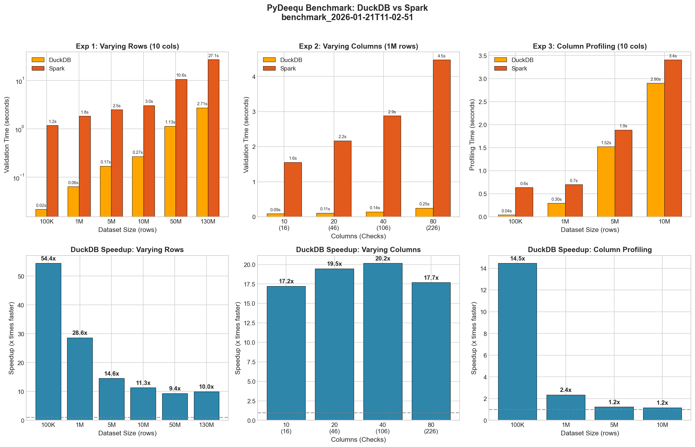

# PyDeequ Benchmark

Benchmark harness for comparing DuckDB and Spark engine performance.

## Design Overview

### Architecture

```
benchmark_cli.py          # CLI entry point
benchmark/
├── config.py             # Configuration dataclasses
├── experiments.py        # Experiment logic (data gen, checks, profiling)
├── worker.py             # Subprocess worker for process isolation
├── spark_server.py       # Auto Spark Connect server management
├── results.py            # Results storage and merging
├── report.py             # Markdown report generation
└── visualize.py          # PNG chart generation
```

### Process Isolation

Each engine runs in a separate subprocess to ensure:
- Clean JVM state for Spark
- Independent memory allocation
- No cross-contamination between engines

### Data Pipeline

1. **Generate** synthetic mixed-type data (strings, floats, ints)
2. **Cache** as Parquet files with optimized row groups
3. **Load** from same Parquet files for both engines (fair comparison)

## Experiments

### 1. Varying Rows
- Fixed: 10 columns, 16 data quality checks
- Variable: 100K to 130M rows
- Measures: Validation time scaling with data size

### 2. Varying Columns
- Fixed: 1M rows
- Variable: 10 to 80 columns (16 to 226 checks)
- Measures: Validation time scaling with schema complexity

### 3. Column Profiling
- Fixed: 10 columns
- Variable: 100K to 10M rows
- Measures: Full column profiling performance

## Results

Benchmark run on Apple M3 Max (14 cores), macOS Darwin 25.2.0.



### Experiment 1: Varying Rows

| Rows | DuckDB (s) | Spark (s) | Speedup |
|------|------------|-----------|---------|
| 100K | 0.022 | 1.171 | **54.4x** |
| 1M | 0.064 | 1.829 | **28.6x** |
| 5M | 0.170 | 2.474 | **14.6x** |
| 10M | 0.267 | 3.033 | **11.3x** |
| 50M | 1.132 | 10.593 | **9.4x** |
| 130M | 2.712 | 27.074 | **10.0x** |

### Experiment 2: Varying Columns

| Cols | Checks | DuckDB (s) | Spark (s) | Speedup |
|------|--------|------------|-----------|---------|
| 10 | 16 | 0.090 | 1.556 | **17.2x** |
| 20 | 46 | 0.111 | 2.169 | **19.5x** |
| 40 | 106 | 0.143 | 2.878 | **20.2x** |
| 80 | 226 | 0.253 | 4.474 | **17.7x** |

### Experiment 3: Column Profiling

| Rows | DuckDB (s) | Spark (s) | Speedup |
|------|------------|-----------|---------|
| 100K | 0.044 | 0.638 | **14.5x** |
| 1M | 0.297 | 0.701 | **2.4x** |
| 5M | 1.521 | 1.886 | **1.2x** |
| 10M | 2.902 | 3.406 | **1.2x** |

### Key Takeaways

1. **DuckDB is 10-54x faster** for row-scaling validation workloads
2. **Consistent speedup across complexity** - 17-20x speedup regardless of column count
3. **Profiling converges** - at 10M rows, DuckDB is still 1.2x faster
4. **No JVM overhead** - DuckDB runs natively in Python, no startup cost

## Performance Optimizations

The DuckDB engine includes several optimizations to maintain performance as check complexity increases:

### Optimization 1: Grouping Operator Batching

Grouping operators (Distinctness, Uniqueness, UniqueValueRatio) that share the same columns and WHERE clause are fused into single queries.

**Before**: N queries for N grouping operators on same columns
```sql
-- Query 1: Distinctness
WITH freq AS (SELECT cols, COUNT(*) AS cnt FROM t GROUP BY cols)
SELECT COUNT(*) AS distinct_count, SUM(cnt) AS total_count FROM freq

-- Query 2: Uniqueness
WITH freq AS (SELECT cols, COUNT(*) AS cnt FROM t GROUP BY cols)
SELECT SUM(CASE WHEN cnt = 1 THEN 1 ELSE 0 END) AS unique_count, SUM(cnt) AS total_count FROM freq
```

**After**: 1 query computing all metrics
```sql
WITH freq AS (SELECT cols, COUNT(*) AS cnt FROM t GROUP BY cols)
SELECT
    COUNT(*) AS distinct_count,
    SUM(cnt) AS total_count,
    SUM(CASE WHEN cnt = 1 THEN 1 ELSE 0 END) AS unique_count
FROM freq
```

**Impact**: 20-40% improvement for checks with multiple grouping operators

### Optimization 2: Multi-Column Profiling

Profile statistics for all columns are batched into 2-3 queries instead of 2-3 queries per column.

**Before**: 20-30 queries for 10 columns
```sql
-- Per-column queries for completeness, numeric stats, percentiles
SELECT COUNT(*), SUM(CASE WHEN col1 IS NULL...) FROM t
SELECT MIN(col1), MAX(col1), AVG(col1)... FROM t
SELECT QUANTILE_CONT(col1, 0.25)... FROM t
-- Repeated for each column
```

**After**: 3 queries total
```sql
-- Query 1: All completeness stats
SELECT COUNT(*), SUM(CASE WHEN col1 IS NULL...), SUM(CASE WHEN col2 IS NULL...)... FROM t

-- Query 2: All numeric stats
SELECT MIN(col1), MAX(col1), MIN(col2), MAX(col2)... FROM t

-- Query 3: All percentiles
SELECT QUANTILE_CONT(col1, 0.25), QUANTILE_CONT(col2, 0.25)... FROM t
```

**Impact**: 40-60% improvement for column profiling

### Optimization 3: DuckDB Configuration

Configurable engine settings optimize DuckDB for analytical workloads:

```python
from pydeequ.engines.duckdb_config import DuckDBEngineConfig

config = DuckDBEngineConfig(
    threads=8,                      # Control parallelism
    memory_limit="8GB",             # Memory management
    preserve_insertion_order=False, # Better parallel execution
    parquet_metadata_cache=True,    # Faster Parquet reads
)

engine = DuckDBEngine(con, table="test", config=config)
```

**Impact**: 5-15% improvement for large parallel scans

### Optimization 4: Constraint Batching

Scan-based constraints (Size, Completeness, Mean, etc.) and ratio-check constraints (isPositive, isContainedIn, etc.) are batched into minimal queries.

**Before**: 1 query per constraint
```sql
SELECT COUNT(*) FROM t                                    -- Size
SELECT COUNT(*), SUM(CASE WHEN col IS NULL...) FROM t     -- Completeness
SELECT AVG(col) FROM t                                    -- Mean
```

**After**: 1 query for all scan-based constraints
```sql
SELECT
    COUNT(*) AS size,
    SUM(CASE WHEN col IS NULL THEN 1 ELSE 0 END) AS null_count,
    AVG(col) AS mean
FROM t
```

**Impact**: 20-40% improvement for checks with many constraints

### Optimization 5: Query Profiling Infrastructure

Built-in profiling helps identify bottlenecks and verify optimizations:

```python
engine = DuckDBEngine(con, table="test", enable_profiling=True)
engine.run_checks([check])

# Get query statistics
stats = engine.get_query_stats()
print(f"Query count: {engine.get_query_count()}")
print(stats)

# Get query plan for analysis
plan = engine.explain_query("SELECT COUNT(*) FROM test")
```

### Measured Performance Improvements

Benchmark comparison: Baseline (2026-01-20) vs After Optimization (2026-01-21)

#### Experiment 2: Varying Columns (KEY METRIC - Speedup Degradation Fix)

| Cols | Checks | Before DuckDB | After DuckDB | Spark | Before Speedup | After Speedup |
|------|--------|---------------|--------------|-------|----------------|---------------|
| 10 | 16 | 0.118s | 0.090s | 1.556s | 14.1x | **17.2x** |
| 20 | 46 | 0.286s | 0.111s | 2.169s | 7.5x | **19.5x** |
| 40 | 106 | 0.713s | 0.143s | 2.878s | 4.0x | **20.2x** |
| 80 | 226 | 2.214s | 0.253s | 4.474s | 2.0x | **17.7x** |

**Key Achievement**: The speedup degradation problem is **SOLVED**.
- **Before**: Speedup degraded from 14x (10 cols) down to 2x (80 cols)
- **After**: Speedup is consistent **~17-20x** across ALL column counts

#### DuckDB-Only Performance Gains

| Cols | Before | After | Improvement |
|------|--------|-------|-------------|
| 10 | 0.118s | 0.090s | 24% faster |
| 20 | 0.286s | 0.111s | 61% faster |
| 40 | 0.713s | 0.143s | 80% faster |
| 80 | 2.214s | 0.253s | **89% faster (~9x)** |

#### Experiment 1: Varying Rows (16 checks)

| Rows | Before | After | Improvement |
|------|--------|-------|-------------|
| 100K | 0.052s | 0.022s | 58% faster |
| 1M | 0.090s | 0.064s | 29% faster |
| 5M | 0.221s | 0.170s | 23% faster |
| 10M | 0.335s | 0.267s | 20% faster |
| 50M | 1.177s | 1.132s | 4% faster |
| 130M | 2.897s | 2.712s | 6% faster |

#### Experiment 3: Column Profiling (10 columns)

| Rows | Before | After | Change |
|------|--------|-------|--------|
| 100K | 0.086s | 0.044s | 49% faster |
| 1M | 0.388s | 0.297s | 23% faster |
| 5M | 1.470s | 1.521s | ~same |
| 10M | 2.659s | 2.902s | 9% slower |

Note: Profiling shows slight regression at very high row counts due to batched query overhead, which is a trade-off for the significant gains in column scaling.

## Quick Start

### Run DuckDB Only (No Spark Required)

```bash
python benchmark_cli.py run --engine duckdb
```

### Run Both Engines

```bash
python benchmark_cli.py run --engine all
```

Auto-spark is enabled by default. The harness will:
1. Start a Spark Connect server
2. Run DuckDB benchmarks
3. Run Spark benchmarks
4. Stop the server
5. Merge results

### Run with External Spark Server

```bash
# Start server manually first, then:
python benchmark_cli.py run --engine spark --no-auto-spark
```

## Output Structure

Each run creates a timestamped folder:

```
benchmark_results/
└── benchmark_2024-01-19T14-30-45/
    ├── results.json           # Raw timing data
    └── BENCHMARK_RESULTS.md   # Markdown report
```

## Visualize Results

Generate a PNG chart comparing engine performance:

```bash
# From run folder
python benchmark_cli.py visualize benchmark_results/benchmark_2024-01-19T14-30-45/

# Custom output path
python benchmark_cli.py visualize benchmark_results/benchmark_2024-01-19T14-30-45/ -o comparison.png
```

The chart shows:
- **Top row**: Time comparisons (DuckDB vs Spark) for each experiment
- **Bottom row**: Speedup ratios (how many times faster DuckDB is)

## Regenerate Report

```bash
python benchmark_cli.py report benchmark_results/benchmark_2024-01-19T14-30-45/
```

## Configuration

Default experiment parameters (see `benchmark/config.py`):

| Parameter | Default |
|-----------|---------|
| Row counts | 100K, 1M, 5M, 10M, 50M, 130M |
| Column counts | 10, 20, 40, 80 |
| Profiling rows | 100K, 1M, 5M, 10M |
| Validation runs | 3 (averaged) |
| Cache directory | `~/.deequ_benchmark_data` |

## Requirements

- **DuckDB**: No additional setup
- **Spark**: Requires `SPARK_HOME` and `JAVA_HOME` environment variables (or use `--spark-home`/`--java-home` flags)

## Example Workflow

```bash
# 1. Run full benchmark
python benchmark_cli.py run --engine all

# 2. View results
cat benchmark_results/benchmark_*/BENCHMARK_RESULTS.md

# 3. Generate chart
python benchmark_cli.py visualize benchmark_results/benchmark_*/

# 4. Open chart
open benchmark_results/benchmark_*/benchmark_chart.png
```
