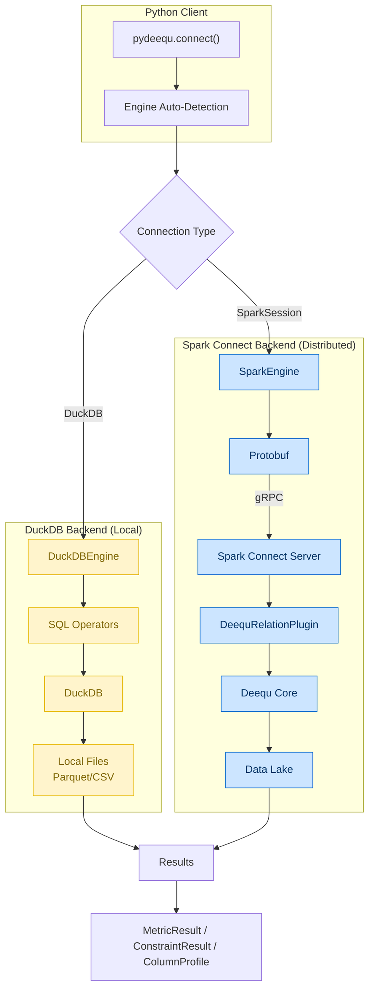
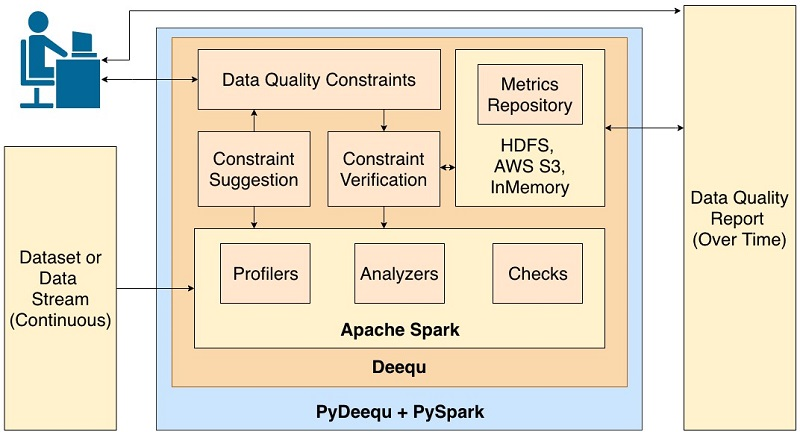

# PyDeequ

PyDeequ is a Python API for [Deequ](https://github.com/awslabs/deequ), a library built on top of Apache Spark for defining "unit tests for data", which measure data quality in large datasets.

[](https://opensource.org/licenses/Apache-2.0) 

## What's New in PyDeequ 2.0

PyDeequ 2.0 introduces a new multi-engine architecture with **DuckDB** and **Spark Connect** backends:

| Feature | PyDeequ 1.x | PyDeequ 2.0 |
|---------|-------------|-------------|
| Backends | Spark only (Py4J) | DuckDB, Spark Connect |
| JVM Required | Yes | No (DuckDB) / Yes (Spark) |
| Assertions | Python lambdas | Serializable predicates |
| Remote Execution | No | Yes (Spark Connect) |

**Key Benefits:**
- **DuckDB backend** - Lightweight, no JVM required, perfect for local development and CI/CD
- **Spark Connect backend** - Production-scale processing with remote cluster support
- **Serializable predicates** - Replace Python lambdas with predicate objects (`eq`, `gte`, `between`, etc.)
- **Unified API** - Same code works with both backends

### Architecture


```mermaid
flowchart TB
    subgraph CLIENT["Python Client"]
        A["pydeequ.connect()"] --> B["Engine Auto-Detection"]
    end

    B --> C{Connection Type}

    C -->|DuckDB| D["DuckDBEngine"]
    C -->|SparkSession| E["SparkEngine"]

    subgraph DUCKDB["DuckDB Backend (Local)"]
        D --> F["SQL Operators"] --> G["DuckDB"] --> H["Local Files<br/>Parquet/CSV"]
    end

    subgraph SPARK["Spark Connect Backend (Distributed)"]
        E --> I["Protobuf"] -- gRPC --> J["Spark Connect Server"]
        J --> K["DeequRelationPlugin"] --> L["Deequ Core"] --> M["Data Lake"]
    end

    H --> N["Results"]
    M --> N
    N --> O["MetricResult / ConstraintResult / ColumnProfile"]

    classDef duckdb fill:#FFF4CC,stroke:#E6B800,color:#806600;
    classDef spark fill:#CCE5FF,stroke:#0066CC,color:#003366;
    class D,F,G,H duckdb;
    class E,I,J,K,L,M spark;
```

**How it works:**
- **Auto-detection**: `pydeequ.connect()` inspects the connection type and creates the appropriate engine
- **DuckDB path**: Direct SQL execution in-process, no JVM required
- **Spark path**: Protobuf serialization over gRPC to Spark Connect server with Deequ plugin
- **Unified results**: Both engines return the same `MetricResult`, `ConstraintResult`, and `ColumnProfile` types

### Feature Support Matrix

| Feature | PyDeequ 1.x | PyDeequ 2.0 (DuckDB) | PyDeequ 2.0 (Spark) |
|---------|:-----------:|:--------------------:|:-------------------:|
| **Constraint Verification** | | | |
| VerificationSuite | Yes | Yes | Yes |
| Check constraints | Yes | Yes | Yes |
| Custom SQL expressions | Yes | Yes | Yes |
| **Metrics & Analysis** | | | |
| AnalysisRunner | Yes | Yes | Yes |
| All standard analyzers | Yes | Yes | Yes |
| **Column Profiling** | | | |
| ColumnProfilerRunner | Yes | Yes | Yes |
| Numeric statistics | Yes | Yes | Yes |
| KLL sketch profiling | Yes | No | Yes |
| Low-cardinality histograms | Yes | Yes | Yes |
| **Constraint Suggestions** | | | |
| ConstraintSuggestionRunner | Yes | Yes | Yes |
| Rule sets (DEFAULT, EXTENDED, etc.) | Yes | Yes | Yes |
| Train/test split evaluation | Yes | No | Yes |
| **Metrics Repository** | | | |
| FileSystemMetricsRepository | Yes | Planned | Planned |
| **Execution Environment** | | | |
| JVM Required | Yes | No | Yes |
| Local execution | Yes | Yes | Yes |
| Remote execution | No | No | Yes |

---

## Installation

PyDeequ 2.0 supports multiple backends. Install only what you need:

**From PyPI (when published):**
```bash
# DuckDB backend (lightweight, no JVM required)
pip install pydeequ[duckdb]

# Spark Connect backend (for production-scale processing)
pip install pydeequ[spark]

# Both backends
pip install pydeequ[all]

# Development (includes all backends + test tools)
pip install pydeequ[dev]
```

**From GitHub Release (beta):**
```bash
# Install beta wheel + DuckDB
pip install https://github.com/awslabs/python-deequ/releases/download/v2.0.0b1/pydeequ-2.0.0b1-py3-none-any.whl
pip install duckdb

# For Spark backend, also install:
pip install pyspark[connect]==3.5.0
```

---

## Quick Start with DuckDB (Recommended for Getting Started)

The DuckDB backend is the easiest way to get started - no JVM or Spark server required.

### Requirements
- Python 3.9+

### Installation

```bash
pip install pydeequ[duckdb]
```

### Run Your First Check

```python
import duckdb
import pydeequ
from pydeequ.v2.verification import AnalysisRunner, VerificationSuite
from pydeequ.v2.analyzers import Size, Completeness, Mean
from pydeequ.v2.checks import Check, CheckLevel
from pydeequ.v2.predicates import eq, gte

# Create a DuckDB connection and load data
con = duckdb.connect()
con.execute("""
    CREATE TABLE users AS SELECT * FROM (VALUES
        (1, 'Alice', 25),
        (2, 'Bob', 30),
        (3, 'Charlie', NULL)
    ) AS t(id, name, age)
""")

# Create an engine from the connection
engine = pydeequ.connect(con)

# Run analyzers
result = (AnalysisRunner(engine)
    .onData(table="users")
    .addAnalyzer(Size())
    .addAnalyzer(Completeness("id"))
    .addAnalyzer(Completeness("age"))
    .addAnalyzer(Mean("age"))
    .run())

print("Metrics:")
print(result.to_string(index=False))

# Run constraint checks
check = (Check(CheckLevel.Error, "Data quality checks")
    .hasSize(eq(3))
    .isComplete("id")
    .isComplete("name")
    .hasCompleteness("age", gte(0.5)))

result = (VerificationSuite(engine)
    .onData(table="users")
    .addCheck(check)
    .run())

print("\nConstraint Results:")
print(result.to_string(index=False))

con.close()
```

---

## Quick Start with Spark Connect (Production Scale)

For production workloads and large-scale data processing, use the Spark Connect backend.

### Requirements

- Python 3.9+
- Apache Spark 3.5.0+
- Java 17 (Java 21+ has known compatibility issues with Spark 3.5)

### Step 1: Download Deequ Pre-release JAR

Download the pre-compiled Deequ JAR with Spark Connect support from the [GitHub pre-releases](https://github.com/awslabs/python-deequ/releases):

```bash
mkdir -p ~/deequ-beta && cd ~/deequ-beta

curl -L -o deequ_2.12-2.1.0b-spark-3.5.jar \
  https://github.com/awslabs/python-deequ/releases/download/v2.0.0b1/deequ_2.12-2.1.0b-spark-3.5.jar
```

### Step 2: Set Up Spark (if needed)

Optional, should only be needed for quick local testing. 
```bash
# Download Spark 3.5
curl -L -o spark-3.5.0-bin-hadoop3.tgz \
  https://archive.apache.org/dist/spark/spark-3.5.0/spark-3.5.0-bin-hadoop3.tgz

tar -xzf spark-3.5.0-bin-hadoop3.tgz

export SPARK_HOME=~/deequ-beta/spark-3.5.0-bin-hadoop3
export PATH=$SPARK_HOME/bin:$PATH
```

### Step 3: Start Spark Connect Server

Spark Connect is a client-server architecture introduced in Spark 3.4 that allows remote connectivity to Spark clusters. For more details, see the [Spark Connect Overview](https://spark.apache.org/docs/latest/spark-connect-overview.html).

```bash
export JAVA_HOME=/path/to/java17

$SPARK_HOME/sbin/start-connect-server.sh \
  --packages org.apache.spark:spark-connect_2.12:3.5.0 \
  --jars ~/deequ-beta/deequ_2.12-2.1.0b-spark-3.5.jar \
  --conf spark.connect.extensions.relation.classes=com.amazon.deequ.connect.DeequRelationPlugin
```

**Command explanation:**
| Option | Description |
|--------|-------------|
| `--packages` | Downloads the Spark Connect package from Maven |
| `--jars` | Loads the Deequ JAR with Spark Connect support |
| `--conf spark.connect.extensions.relation.classes` | Registers the Deequ plugin to handle custom operations |

The server starts on `localhost:15002` by default. You can verify it's running:
```bash
ps aux | grep SparkConnectServer
```

### Step 4: Install PyDeequ 2.0

Install the beta wheel directly from the GitHub release:

```bash
pip install https://github.com/awslabs/python-deequ/releases/download/v2.0.0b1/pydeequ-2.0.0b1-py3-none-any.whl
pip install pyspark[connect]==3.5.0

# Python 3.12+ users: install setuptools (provides distutils removed in 3.12)
pip install setuptools
```

Or using the extras syntax (once published to PyPI):
```bash
pip install pydeequ[spark]
```

### Step 5: Run Your First Check

```python
from pyspark.sql import SparkSession, Row
import pydeequ
from pydeequ.v2.checks import Check, CheckLevel
from pydeequ.v2.verification import VerificationSuite
from pydeequ.v2.predicates import eq, gte

# Connect to Spark Connect server
spark = SparkSession.builder.remote("sc://localhost:15002").getOrCreate()
engine = pydeequ.connect(spark)

# Create sample data
df = spark.createDataFrame([
    Row(id=1, name="Alice", age=25),
    Row(id=2, name="Bob", age=30),
    Row(id=3, name="Charlie", age=None),
])

# Define checks using the new predicate API
check = (Check(CheckLevel.Error, "Data quality checks")
    .hasSize(eq(3))
    .isComplete("id")
    .isComplete("name")
    .hasCompleteness("age", gte(0.5))
    .isUnique("id"))

# Run verification
result = (VerificationSuite(engine)
    .onData(dataframe=df)
    .addCheck(check)
    .run())

print(result.to_string(index=False))
spark.stop()
```

### Stop the Server

```bash
$SPARK_HOME/sbin/stop-connect-server.sh
```

### Full Example

For a comprehensive example covering data analysis, constraint verification, column profiling, and constraint suggestions, see [tutorials/data_quality_example_v2.py](tutorials/data_quality_example_v2.py).

---

## PyDeequ 2.0 API Reference

### Predicates (replace lambdas)

```python
from pydeequ.v2.predicates import eq, gt, gte, lt, lte, between

check.hasSize(eq(3))              # size == 3
check.hasCompleteness("col", gte(0.9))  # completeness >= 0.9
check.hasMean("value", between(10, 20)) # 10 <= mean <= 20
```

| Predicate | Description | Example |
|-----------|-------------|---------|
| `eq(v)` | Equal to v | `eq(1.0)` |
| `gt(v)` | Greater than v | `gt(0)` |
| `gte(v)` | Greater than or equal | `gte(0.9)` |
| `lt(v)` | Less than v | `lt(100)` |
| `lte(v)` | Less than or equal | `lte(1.0)` |
| `between(a, b)` | Between a and b (inclusive) | `between(0, 1)` |

### Analyzers

```python
from pydeequ.v2.verification import AnalysisRunner
from pydeequ.v2.analyzers import (
    Size, Completeness, Mean, Sum, Minimum, Maximum,
    StandardDeviation, ApproxCountDistinct, Distinctness,
    Uniqueness, Entropy, Correlation
)

# DuckDB
result = (AnalysisRunner(engine)
    .onData(table="users")
    .addAnalyzer(Size())
    .addAnalyzer(Completeness("name"))
    .addAnalyzer(Mean("age"))
    .run())

# Spark
result = (AnalysisRunner(engine)
    .onData(dataframe=df)
    .addAnalyzer(Size())
    .addAnalyzer(Completeness("name"))
    .addAnalyzer(Mean("age"))
    .run())
```

### Constraint Methods

| Method | Description |
|--------|-------------|
| `hasSize(predicate)` | Check total row count |
| `isComplete(column)` | Check column has no nulls |
| `hasCompleteness(column, predicate)` | Check completeness ratio |
| `areComplete(columns)` | Check multiple columns have no nulls |
| `isUnique(column)` | Check column values are unique |
| `hasUniqueness(columns, predicate)` | Check uniqueness ratio |
| `hasDistinctness(columns, predicate)` | Check distinctness ratio |
| `hasMin(column, predicate)` | Check minimum value |
| `hasMax(column, predicate)` | Check maximum value |
| `hasMean(column, predicate)` | Check mean value |
| `hasSum(column, predicate)` | Check sum |
| `hasStandardDeviation(column, predicate)` | Check standard deviation |
| `hasApproxCountDistinct(column, predicate)` | Check approximate distinct count |
| `hasCorrelation(col1, col2, predicate)` | Check correlation between columns |
| `hasEntropy(column, predicate)` | Check entropy |
| `hasApproxQuantile(column, quantile, predicate)` | Check approximate quantile |
| `satisfies(expression, name, predicate)` | Custom SQL expression |
| `hasPattern(column, pattern, predicate)` | Check regex pattern match ratio |
| `containsEmail(column, predicate)` | Check email format ratio |
| `containsCreditCardNumber(column, predicate)` | Check credit card format ratio |
| `isNonNegative(column)` | Check all values >= 0 |
| `isPositive(column)` | Check all values > 0 |

### Column Profiler

Profile column distributions and statistics across your dataset:

```python
from pydeequ.v2.profiles import ColumnProfilerRunner

# Basic profiling
profiles = (ColumnProfilerRunner(engine)
    .onData(table="users")          # DuckDB: use table=
    # .onData(dataframe=df)         # Spark: use dataframe=
    .run())

print(profiles)

# With options
profiles = (ColumnProfilerRunner(engine)
    .onData(table="users")
    .restrictToColumns(["id", "name", "age"])
    .withLowCardinalityHistogramThreshold(100)
    .run())
```

**Profile Result Schema:**

| Column | Type | Description |
|--------|------|-------------|
| `column` | STRING | Column name |
| `completeness` | DOUBLE | Non-null ratio (0.0-1.0) |
| `approx_distinct_values` | LONG | Approximate cardinality |
| `data_type` | STRING | Detected data type |
| `is_data_type_inferred` | BOOLEAN | Whether type was inferred |
| `type_counts` | STRING | JSON of type distribution |
| `histogram` | STRING | JSON histogram (low cardinality only) |
| `mean` | DOUBLE | Mean (numeric columns only) |
| `minimum` | DOUBLE | Minimum value (numeric only) |
| `maximum` | DOUBLE | Maximum value (numeric only) |
| `sum` | DOUBLE | Sum (numeric only) |
| `std_dev` | DOUBLE | Standard deviation (numeric only) |
| `approx_percentiles` | STRING | JSON percentiles (numeric only) |
| `kll_buckets` | STRING | JSON KLL buckets (if enabled) |

### Constraint Suggestions

Auto-generate data quality constraints based on your data:

```python
from pydeequ.v2.suggestions import ConstraintSuggestionRunner, Rules

# Basic suggestion generation
suggestions = (ConstraintSuggestionRunner(engine)
    .onData(table="users")          # DuckDB: use table=
    # .onData(dataframe=df)         # Spark: use dataframe=
    .addConstraintRules(Rules.DEFAULT)
    .run())

print(suggestions)
```

**Available Rule Sets:**

| Rule Set | Description |
|----------|-------------|
| `Rules.DEFAULT` | Completeness, type, categorical range, non-negative |
| `Rules.STRING` | String length constraints (min/max length) |
| `Rules.NUMERICAL` | Numeric constraints (min, max, mean, stddev) |
| `Rules.COMMON` | Uniqueness for approximately unique columns |
| `Rules.EXTENDED` | All rules combined |

**Suggestion Result Schema:**

| Column | Type | Description |
|--------|------|-------------|
| `column_name` | STRING | Column the constraint applies to |
| `constraint_name` | STRING | Type of constraint |
| `current_value` | STRING | Current metric value |
| `description` | STRING | Human-readable description |
| `suggesting_rule` | STRING | Rule that generated this |
| `code_for_constraint` | STRING | Python code snippet |
| `evaluation_status` | STRING | "Success" or "Failure" (if train/test enabled) |
| `evaluation_metric_value` | DOUBLE | Metric value on test set |

### Migration from 1.x to 2.0

**Import changes:**
```python
# Before (1.x)
from pydeequ.checks import Check, CheckLevel
from pydeequ.verification import VerificationSuite

# After (2.0)
from pydeequ.v2.checks import Check, CheckLevel
from pydeequ.v2.verification import VerificationSuite
from pydeequ.v2.predicates import eq, gte, between
```

**Lambda to predicate:**
```python
# Before (1.x)
check.hasSize(lambda x: x == 3)
check.hasCompleteness("col", lambda x: x >= 0.9)

# After (2.0)
check.hasSize(eq(3))
check.hasCompleteness("col", gte(0.9))
```

**Profiler changes:**
```python
# Before (1.x) - returns Python object
from pydeequ.profiles import ColumnProfilerRunner
result = ColumnProfilerRunner(spark).onData(df).run()
for col, profile in result.profiles.items():
    print(profile)

# After (2.0) - unified engine API
import pydeequ
from pydeequ.v2.profiles import ColumnProfilerRunner
engine = pydeequ.connect(spark)
result = ColumnProfilerRunner(engine).onData(dataframe=df).run()
print(result)
```

**Suggestions changes:**
```python
# Before (1.x) - returns Python object
from pydeequ.suggestions import ConstraintSuggestionRunner, DEFAULT
result = ConstraintSuggestionRunner(spark).onData(df).addConstraintRule(DEFAULT()).run()
print(result)

# After (2.0) - unified engine API
import pydeequ
from pydeequ.v2.suggestions import ConstraintSuggestionRunner, Rules
engine = pydeequ.connect(spark)
result = ConstraintSuggestionRunner(engine).onData(dataframe=df).addConstraintRules(Rules.DEFAULT).run()
print(result)
```

---

## PyDeequ 2.0 Troubleshooting

### Server won't start
1. Check Java version: `java -version` (must be Java 17, not 21+)
2. Check port availability: `lsof -i :15002`
3. Check logs: `tail -f $SPARK_HOME/logs/spark-*-SparkConnectServer-*.out`

### Connection refused
Ensure the Spark Connect server is running:
```bash
ps aux | grep SparkConnectServer
```

### ClassNotFoundException: DeequRelationPlugin
Ensure the Deequ JAR is correctly specified in `--jars` when starting the server.

### UnsupportedOperationException: sun.misc.Unsafe not available
This error occurs when using Java 21+ with Spark 3.5. Use Java 17 instead:
```bash
export JAVA_HOME=/path/to/java17
```

### ModuleNotFoundError: No module named 'distutils'
This occurs on Python 3.12+ because `distutils` was removed. Install setuptools:
```bash
pip install setuptools
```

---

## PyDeequ 1.x (Legacy)

The legacy PyDeequ API uses Py4J for JVM communication. It is still available for backward compatibility.

### Installation

```bash
# Install with Spark backend (required for 1.x API)
pip install pydeequ[spark]
```

**Note:** Set the `SPARK_VERSION` environment variable to match your Spark version.

### Quick Start (1.x)

```python
from pyspark.sql import SparkSession, Row
import pydeequ

spark = (SparkSession
    .builder
    .config("spark.jars.packages", pydeequ.deequ_maven_coord)
    .config("spark.jars.excludes", pydeequ.f2j_maven_coord)
    .getOrCreate())

df = spark.sparkContext.parallelize([
    Row(a="foo", b=1, c=5),
    Row(a="bar", b=2, c=6),
    Row(a="baz", b=3, c=None)
]).toDF()
```

### Analyzers (1.x)

```python
from pydeequ.analyzers import *

analysisResult = AnalysisRunner(spark) \
    .onData(df) \
    .addAnalyzer(Size()) \
    .addAnalyzer(Completeness("b")) \
    .run()

analysisResult_df = AnalyzerContext.successMetricsAsDataFrame(spark, analysisResult)
analysisResult_df.show()
```

### Constraint Verification (1.x)

```python
from pydeequ.checks import *
from pydeequ.verification import *

check = Check(spark, CheckLevel.Warning, "Review Check")

checkResult = VerificationSuite(spark) \
    .onData(df) \
    .addCheck(
        check.hasSize(lambda x: x >= 3) \
        .hasMin("b", lambda x: x == 0) \
        .isComplete("c") \
        .isUnique("a") \
        .isContainedIn("a", ["foo", "bar", "baz"]) \
        .isNonNegative("b")) \
    .run()

checkResult_df = VerificationResult.checkResultsAsDataFrame(spark, checkResult)
checkResult_df.show()
```

### Profile (1.x)

```python
from pydeequ.profiles import *

result = ColumnProfilerRunner(spark) \
    .onData(df) \
    .run()

for col, profile in result.profiles.items():
    print(profile)
```

### Constraint Suggestions (1.x)

```python
from pydeequ.suggestions import *

suggestionResult = ConstraintSuggestionRunner(spark) \
    .onData(df) \
    .addConstraintRule(DEFAULT()) \
    .run()

print(suggestionResult)
```

### Repository (1.x)

```python
from pydeequ.repository import *
from pydeequ.analyzers import *

metrics_file = FileSystemMetricsRepository.helper_metrics_file(spark, 'metrics.json')
repository = FileSystemMetricsRepository(spark, metrics_file)
key_tags = {'tag': 'pydeequ hello world'}
resultKey = ResultKey(spark, ResultKey.current_milli_time(), key_tags)

analysisResult = AnalysisRunner(spark) \
    .onData(df) \
    .addAnalyzer(ApproxCountDistinct('b')) \
    .useRepository(repository) \
    .saveOrAppendResult(resultKey) \
    .run()
```

### Wrapping Up (1.x)

```python
spark.sparkContext._gateway.shutdown_callback_server()
spark.stop()
```

---

## Deequ Components

There are 4 main components of Deequ:

- **Metrics Computation**
    - `Profiles` leverages Analyzers to analyze each column of a dataset.
    - `Analyzers` compute metrics for data profiling and validation at scale.
- **Constraint Suggestion**
    - Specify rules for Analyzers to return suggested constraints.
- **Constraint Verification**
    - Validate data against constraints you define.
- **Metrics Repository**
    - Persist and track Deequ runs over time.



---

## Feedback and Issues

Please report any issues or feedback to:
- GitHub Issues: https://github.com/awslabs/deequ/issues
- Tag PyDeequ 2.0 issues with `pydeequ-2.0`

When reporting issues, include:
1. Python version
2. Spark version
3. Java version
4. Operating system
5. Full error message and stack trace
6. Minimal code to reproduce

---

## Contributing

Please refer to the [contributing doc](https://github.com/awslabs/python-deequ/blob/master/CONTRIBUTING.md) for how to contribute to PyDeequ.

## License

This library is licensed under the Apache 2.0 License.

---

## Developer Setup

1. Setup [SDKMAN](#setup-sdkman)
2. Setup [Java](#setup-java)
3. Setup [Apache Spark](#setup-apache-spark)
4. Install [Poetry](#poetry)
5. Run [tests locally](#running-tests-locally)

### Setup SDKMAN

```bash
curl -s https://get.sdkman.io | bash
source "$HOME/.sdkman/bin/sdkman-init.sh"
sdk version
```

### Setup Java

```bash
sdk list java
sdk install java 17.0.9-amzn  # For PyDeequ 2.0
sdk install java 11.0.10.hs-adpt  # For PyDeequ 1.x
```

### Setup Apache Spark

```bash
sdk list spark
sdk install spark 3.5.0
```

### Poetry

```bash
# Install all dependencies (including dev tools and both backends)
poetry install --with dev --all-extras

# Or install specific extras
poetry install --extras duckdb      # DuckDB only
poetry install --extras spark       # Spark only
poetry install --extras all         # Both backends

poetry update
poetry show -o
```

### Running Tests Locally

```bash
# Run all tests (requires Spark Connect server for comparison tests)
poetry run pytest

# Run DuckDB-only tests (no Spark required)
poetry run pytest tests/engines/test_duckdb*.py tests/engines/test_operators.py
```

### Running Tests (Docker)

```bash
docker build . -t spark-3.5-docker-test
docker run spark-3.5-docker-test
```
